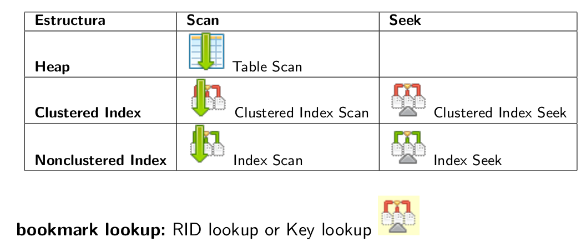
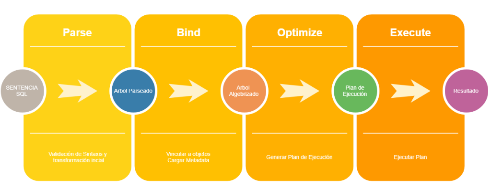
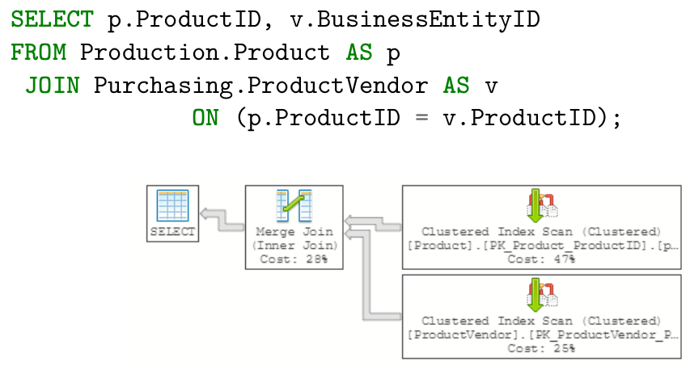
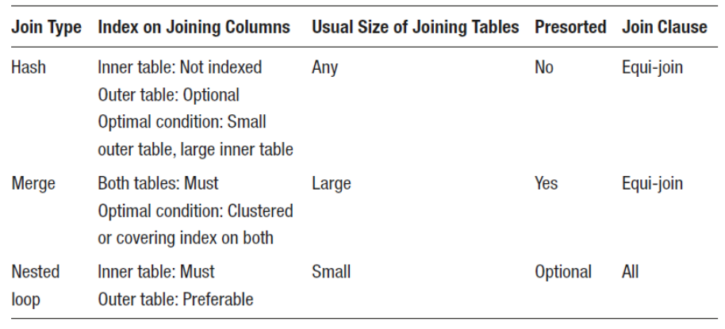

# Optimizacion SQL Server

## Estructura

Sql server almacena los datos en tablas e índices.

Una tabla se puede organizar como

- heap: Cuando no hay clustered index definido
- arbol B: Cuando hay clustered index definido

La unidad de almacenamiento más básica es **la página** (8KB). Cuando se
interactúa con los archivos de la base, la unidad más chica en la que puede
ocurrir una operación de E/S es a nivel de la página.

> Se agrupan en estructuras contiguas de a 8 en *extents* (pueden ser uniformes
o mixtos.)

### Tipos de índices

- **Clustered index**: está ordenado igual que la tabla. Dicta el orden físico
  de los datos en una tabla. Es un árbol B en donde las hojas son las filas de
  datos, ordenadas según las columnas del clustered index key.

  Un clustered index no es una copia de la tabla, *es* la tabla con un árbol B
  encima, para que esté ordenada por la clustering key. Por esto se puede tener
  uno solo por tabla.

- **NonClustered index**: como el de la parte de atrás de un libro, está
  desordenado.

  Están diseñados para mejorar la performance de queries críticas, frecuentes y
  caras. Tiene la misma estructura de árbol B, pero las hojas no contienen las
  filas, solamente la info de la clave del índice cluster (para poder hacer
  seek) + la clustered index key (para poder ir ahí a buscar las rows, asumiendo
  que la tabla es b tree) + columnas extra que agregamos con INCLUDE (por
  conveniencia)

  La estructura es similar a un clustered index, pero las hojas incluyen el
  valor de la clave (para poder hacer seek en el índice) y el row id (para poder
  volver a la tabla original y buscar todos los datos, suponiendo que es heap y
  no b tree)

  El row id,

  - En heap tables representa la ubicación física del a página
  - Para tablas con clustered index, representa el clustered index key de la fila.

Tipos de acceso a datos en índice:



### Leyendo un índice

- **Index Scan**: Recorre todas las hojas del índice

  Usualmente se hace un scan cuando tenemos que leer todas las rows para
  satisfacer la definición del query. También cuando hace falta leer tantas rows
  que es más rápido scanear todas que navegar la estructura del índice para
  encontrarlas (seek)

  Las operaciones son

  - Clustered index scan cuando es un clustered index
  - Index scan (nonclustered) cuando no es clustered
  - Table scan: cuando es un heap table, sin un clustered index

  Los scans no son malos necesariamente. Pero como procesar rows demás es una
  pérdida de recursos, puede ser un indicador de un problema potencial.

- **Index Seek**: Recorre solo las hojas del índice que necesita (puede ser una
  o un rango).

  Tal como un scan no necesariamente es siempre malo, un seek no necesariamente
  es siempre bueno.

  Ocurre cuando,

  - El índice matchea con una predicate column usada en el query, y el índice
    cubre la query (puede proveer todas las columnas requeridas por el query)
  
  - El índice matchea con el predicate column usada en el query, no cubre el
    query, pero el predicado es muy selectivo (retorna solo un % pequeño de las
    rows).
  
  Las operaciones son
  
  - Clustered index seek. Como las hojas de un clustered index contienen toda la
    información de la row, no hace falta ha cer más reads.

  - Index seek (nonclustered)

    En un índice nonclustered las hojas contienen solamente las columnas
    indexadas + columnas del clustered index + las incluidas con INCLUDE.

    Si el índice *cubre* el query, se puede obtener toda la información
    necesaria desde el índice nonclustered.


  Se dice que un predicado es SARGable (sarch argument) si el optimizador lo
  puede usar en un Index Seek, por ej LIKE 'Duffy%' es pero '%Duffy' no.

- **Key lookup** (Clustered)
    
  Ocurre en adición a un index seek (o scan a veces) cuando el índice no cubre
  al query. El optimizador usa key lookup al clutered index, que obtiene los
  valores para las columnas que no estaban disponibles en el nonclustered
  index.

  Siempre está acompañado de un **nested loop join** para juntar los
  resultados de las dos operaciones.

### Leyendo un heap

Un heap es una tabla sin un clustered index, en donde los datos no tienen orden
(más que en el que llegaron las cosas). Pero se les puede agregar índices
nonclustered, en cuyo caso las hojas en vez de tener la clave del clustered
index, tienen un *row id*: en dónde está guardada la fila en el heap.

- **Table Scan**

  Solo ocurren contra heap tables. Ocurre cuando es más rápido que usar un
  índice, que es cuando se van a retornar casi todas las rows.

- **RID Lookup** (Heap)

  RID = row id

  Es como el key lookup pero para índices nonclustered sobre heaps. También se
  ve acompañado de un Nested loops join.

## Procesamiento de consultas



## Plan de ejecución

Para algunos operadores es necesario que los datos vengan ordenados. Y el
optimizador puede usar un índice existente como orden o introducir un *sort
operator* explícitamente.

### Sort

Tanto el sort como el *hashing* durante la fase de construcción de la tabla son
operaciones *blocking* o *stop and go*. No pueden producir filas hasta que hayan
consumido toda su información.

### Agregacion

Para producir agregaciones hay dos operadores


- **Stream aggregate**. Cuando tienen un agregado pero no hay group by (scalar
  aggregate) se implementan mediante stream. Si hay group by tienen que venir
  ordenados (indice clustered o sort)

- **Hash aggregate**. Al igual que el hash join se implementa con el operador
  físico **hash match**.

  Se elige para tablas grandes en donde los *datos no están ordenados*, no es
  necesario ordenarlos y su cardinalidad se estima en solo unos pocos grupos.

  Por ejemplo,

  ```sql
  SELECT City, COUNT(City) AS CityCount
  FROM Person.Address
  GROUP BY City
  ```

Se usan para SUM, AVG, MAX y GROUP BY, DISTINCT

Cuando se usa cada uno?

- Si los datos no están ordenados, hash aggregate. Pero si se crea un índice que
  pueda dar los datos ordenados, el optimizador puede seleccionar stream
  aggregate.

- Si la entrada no está ordenada pero se pide que esté ordenado el resultado en
  una consulta, el optimizador puede introducir un *sort operator* y usar
  *stream aggregate* o decidir usar un *hash aggregate* y ordenar los resultados
  después.

### Joins

Tipos de joins. 4 operadores físicos:

- **Nested loops**: para cada row del top data set, hacer una búsqueda en el otro
  para los valores que matchean (puede ser con un índice o sin)

- **Hash match**: crea un hash table con las rows del top data set, que se probea
  usando las rows del segundo para buscar los valores que coinciden.

- **Merge join**: Leer información de ambos inputs simultáneamente y mergearlos,
  joineando cada fila que matchea. Esto requiere que ambos inputs estén
  ordenados en las columnas del join (i.e indexados con un índice clustered)

- **Adaptive join**: de sql server 2017. Es nested loops + hash match, elige la
  opción con el costo mínimo de runtime, cuando el número real de filas del top
  input es conocido.

> Merge y hash requieren que la junta tenga al menos un predicado basado en
> operador de igualdad (i.e equijoin)

- **Nested loop join**: Todos contra todos

  El output superior es *outer input* y el inferior *inner input*. El operador
  del outer se usa una sola vez, mientras que el del inner se ejecuta una vez
  por cada registro del outer.

  Es muy eficiente si el outer es chico y el inner es barato de buscar.
  Usualmente para lograr esto se indexa el inner (de esa forma, a pesar de que
  sea grande sigue siendo eficiente)

  

- **Merge join**: Como están ordenadas las dos tablas las recorre, O(n)

  Dos tablas ordenadas por un clustered index con la misma key. Ambos operadores
  se ejecutan una sola vez

  

- **Hash join**

  El optimizador lo usa para procesar entradas largas, que no están ordenadas ni
  indexadas eficientemente.

  Usa una estimación de cardinalidad para encontrar la menor de las dos entradas
  (build input) y la usa para crear una tabla hash (si alcanza la memoria en
  memoria, sino tempdb en disco). La segunda tabla (probe input) se lee y
  compara con la tabla de hash, y se devuelven las filas que coinciden.

  En el plan, la tabla en la parte superior se usa como build input y la
  inferior como probe input

  

Resumen:



### Compute scalar

Se usa para conversiones entre tipos de datos

### Filter

Se usa para los having y los where

### Union

Se puede usar merge, hash o concat

Qué es más costoso, UNION o UNION ALL?

### Estadísticas

El optimizador en muchos casos usa estadísticas para tomar decisiones. Entre
ellas está la estimación de *cardinalidad*, el número de valores diferentes, y
cuantas ocurrencias hay de cada uno.

Esto determina la **selectividad** de los datos. Si una columna es única, va a
tener selectividad máxima. Y se degrada a medida que decrece el nivel de
unicidad. Por ejemplo, una columna *género* probablemente tenga una selectividad
baja (i.e poca variación)