# Resumen BD

## Bases de datos

Es una colección de datos relacionados y organizados. Logicamente coherente, con
un significado que depende del dominio en donde se aplica.

Tiene un software adhoc (DMBS) que la administra. Es,

- Persistente
- Tiene consultas (SQL) junto con un módulo que las optimiza (le doy la
  consulta, declarativa, pero no le digo como implementarla físicamente)
- Transacciones: un conjunto de operaciones *atómicas*
  - Ejemplo clásico: Transferencia bancaria de A hacia B tiene 3 operaciones
    - A resta 100
    - B suma 100
    - registro
  - Si esto no es un bloque, puedo tener inconsistencias
  - Cuentan con un mecanismo de rollback y recovery (logging)
- Control de concurrencia
- Backups

Son *autodescriptivas*: saben sus tablas.

Dos grandes lenguajes provistos por los DBMS

- DDL: Data Definition Language. Define las estructuras, el esquema (schema).
- DML: Data Manipulation Language. Permite operar sobre las instancias

## MER / DER

MER = Modelo de Entidad Relación. Es un modelo *conceptual* de alto nivel de los
datos. Representa entidades del mundo real y las relaciones entre ellas.

DER = Diagrama de Entidad Relación

Sirve para modelar los datos. Muesta como se **vinculan** los objetos entre sí.

Conceptos:

- **Entidad**: Objeto *relevante* para mi sistema
  - El desafío es decidir qué % del mundo real recorto
- **Atributo**: Característica *relevante* de una entidad
  - Identificatorios: Puede haber uno o más de uno (elegimos uno solo como PK)
  - Compuestos (por varios sub atributos, por ej. fecha+hora = timestamp)
  - Multivaluados (por ej. mail)
- **Interrelación**: Vínculo entre dos entidades

  - Tienen diferentes *cardinalidades*

    - 1 a 1 (*uno a uno*).
      - Presidente-País
      - Edificio-Terreno
    - 1 a N (*uno a muchos*)
      - Biblioteca-Libro
      - Aplicación-Versión
    - N a M (*muchos a muchos*)
      - Empleado-Empresa
      - App-Usuario
      - Libro-Autor

  - Pueden tener participación parcial o no.

    > Por ejemplo, si tenemos la interrelación "aprobó" entre alumno y materia,
    > puede ser que haya alumnos que no hayan aprobado ninguna materia.

  - Pueden tener atributos
    - Las 1-n no, por definición (Duda: y las 1-1?)
  - Tipos: Unarias (loops), binarias, ternarias.

Crítica al modelo relacional: tenés muchas tablas de referencias (relaciones)

### Datos tabulados

Un motivo para crear una entidad puede ser que tenga una lista de valores
**tabulados**. De esa forma, si tengo que cambiar las posibilidades o un valor
puedo hacerlo en un solo lugar. Ejemplos: País, Provincia, Marcas, etc.

> Esto también se podría hacer con tipos enumerados. Pero la diferencia es que
si quiero modificar un enum, tengo que hacer un ALTER para cambiar el schema. En
cambio, si los tengo en una tabla, alcanza con hacer un INSERT que es más
sencillo.
> También me sirve para ponerle otros atributos además del nombre.

### Entidades débiles

Puede haber *entidades débiles*. Por ejemplo, copa de futbol y tipo copa. Tipo
copa es una entidad débil de copa. Está en su esencia, no puede existir tipo sin
copa.

### Especializaciones

Se pueden hacer especializaciones de las entidades. Por ejemplo, Persona se
especializa en Alumno y Profesor (que a su vez se generalizan en Persona). Estas
pueden ser **overlapping** (como es este caso) o **disjoint**.

Las hacemos si tienen atributos o interrelaciones diferentes entre sí. Sino, no
tiene sentido especializar.

### Ternarias

Necesito las tres en el mismo momento. La cardinalidad se ve 2 contra 1. Por
ejmeplo, Jugador, equipo y rol.

- Para un equipo y rol, tengo N jugadores
- Para un rol y jugador, tengo 1 equipo
- para un equipo y jugador, tengo 1 rol.

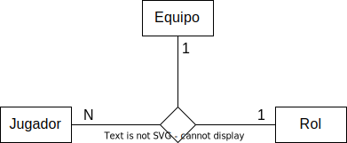

### Agregaciones

- Una abstracción de una interrelación entre dos entidades.
- La hago cuando necesito vincular una interrelación con una entidad.
- Solo se puede con M-N (porque en el pasaje a relacional termina siendo una
  tabla a la que le puedo agregar un ID)
- Tiene que suceder temporalmente antes la agregación que la de afuera. Sino,
  sería una ternaria (y si sucede temporalmente antes, no pueden estar los tres
  a la vez, entonces no puede ser una ternaria)

Un ejemplo es alumno, curso, encuesta y materia

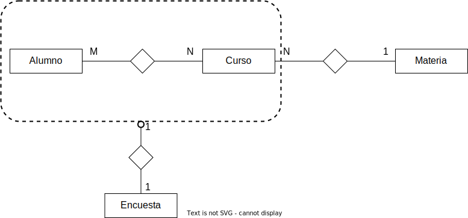

Donde hay participación parcial entre la agregación y la encuesta porque no toda
tupla de la agregación tiene una encuesta

## Modelo relacional

Antes, los datos estaban en texto plano, y no era transparente para el usuario
su ubicación y formato. Las DBs relacionales traen la *independencia física* de
los datos.

Niveles de abstracción

- Vistas (Externo), usado por usuarios finales
  - Abstracción de las tablas. Se usa para proveer políticas de acceso, vistas
    de varios esquemas, etc.
- Tablas (Conceptual), usado por desarrolladores
  - Modelo de datos: Una abstracción del mundo real que está representada
    conceptualmente en la BD
- Interno (Físico), usado por DBAs
  - Colección de archivos, índices y otras estructuras que se usan para acceder
    a datos de forma eficiente.

- externo a conceptual es la *independencia lógica*, uno de los grandes logros
  del modelo relacional. La capacidad del sistema de cambiar el esquema
  conceptual, sin cambiar la vista lógica que el usuario tiene de los datos.

- Y de conceptual a interno la *independencia física*: la capacidad del sistema
de ejecutar cambios sobre la definición y estructura de los datos sin que eso
afecte la BD conceptual.

En el modelo relacional, los registros se abstraen en **relaciones** (que son
*predicados*, inspirados en LPO). Por ejemplo `Estudiante(id, nombre, direccion)`

- Estudiante es el nombre de la relación
- `id`, `nombre`, `direccion` son sus atributos. Cada atributo tiene un dominio

Los registros que pertenecen a la relación son llamados **tuplas**, y no están
ordenados (son conjuntos)

Una relación es un conjunto, que está incluido en el producto cartesiano de
todos los dominios de sus atributos. => no puede haber
repetidos.

> Por esto Codd dice que los modelos anteriores no eran relacionales

Como no hay tuplas duplicadas, si o si hay un conjunto de atributos que
identifican a cada una, que en el peor caso puede ser la unión de todos los
campos. Por lo tanto siempre hay al menos una clave candidata. La que elijo es
la **primary key**.

Se pueden tener claves **foráneas** (que identifican tuplas de otra entidad),
que da *integridad referencial*. Se puede validar al borrar o hacer un update
que la otra exista.

### Pasaje DER a MR

Hay una forma automática de pasar de un DER a las tablas. Es una tarea de **mono
amaestrado**, no hay que tomar decisiones.

Reglas:

1. Cada entidad tiene su tabla
2. Cada atributo es una columna
3. Todas las relaciones m-n dan lugar a una nueva tabla

    > por esto estas relaciones pueden tener atributos

4. Las relaciones 1-n las logramos poniendo el atributo que identifica del lado
   la n
5. Las 1-1 va del lado en donde no haya participacion parcial (para evitar
   NULLs). Si no hay en ninguno, en cualquiera.

## Lenguajes de consulta

### AR (Álgebra Relacional)

Es un lenguaje de consultas **procedural** para el modelo relacional.

Por qué es importante?

- Provee un fundamento formal a las operaciones asociadas al modelo relacional.
  (SQL es la implementación más famosa de algebra relacional)
- Se usa de base para implementar y optimizar queries en RDBMS (usando
propiedades de conmutatividad y eso de las operaciones, que acá no las puse pero
están en las diapos de Vani).

Tiene las siguientes operaciones:

- **Proyección** ($\pi$): Obtiene uno o más campos de una tabla.
  - Genera una *partición vertical* de la relación
  - Ej: $\pi_\text{legajo}$(Alumno)
  - En SQL suele ser WHERE
- **Selección** ($\sigma$): Elige registros que cumplan cierta condición
  - Genera una *partición horizontal* de la relación
  - Ej: $\sigma_\text{codCarrera='A'}$(Alumno)
  - En SQL es SELECT DISTINCT
- **Renombre** ($\rho$): Cambia el nombre de la salida. También permite ordenar
  y guardar soluciones parciales.
  - Notación: $\rho(A_1 \to B_1, \dots, A_n \to B_n, R)$ o $\rho(S, R)$
  - Ej: $\rho(S, \sigma_{attr=val}(R))$
  - En SQL es AS
- Unión, intersección, resta (conjuntos), prod cartesiano
- Join
- Division (no suele ser implementada por SQL)
  
### CRT (Cálculo Relacional de Túplas)

Es un lenguaje de consultas para el modelo relacional. Es **declarativo**,
permite expresar cómo es el conjunto de respuestas que se busca, pero no dice
cómo hacerlo (no es procedural)

Por qué es importante?

- Tiene un sólido fundamento en lógica matemática
- SQL tiene sus bases fundacionales en CRT.

Las expresiones tienen la pinta

$$\{ t \mid COND(t) \}$$

donde

- t es una variable de tipo tupla, la única libre en la expresión.
- COND(t) es una expresión booleana condicional, una fórmula bien formada de CRT
- El resultado es el conjunto de TODAS Las tuplas que satisfacen COND

Las diapos hablan de qué es una fórmula bien formada, es muy parecido a LPO
agregando pertenencia (ej $t \in EMPLEADO$) y operaciones entre constantes y
atributos de las tuplas (ej $r.Depto = s.IDD$ o $r.Salario > 2000$)

(tip: con el $\exists$ va $\wedge$ y con el $\forall$ va $\Rightarrow$)

#### Expresiones seguras

Las **expresiones seguras** son aquellas que garantizan producir una *cantidad
finita de tuplas*. Sino, se dice **expresión insegura**

> Por ejemplo, $\{ t | \neg (t \in \text{EMPLEADO}) \}$ es insegura, porque
> genera una cantidad infinita de tuplas: todas las que no pertenecen a la
> relación EMPLEADO.

Decimos que el *dominio* de una expresión de CRT son los dominios de las
subexpresiones (atributos de las tuplas, y constantes). Una expresión es segura
si todos los valores en el resultado son parte del dominio de la expresión.

> Con esta definición, la expresión anterior es insegura porque el resultado
> incluye elementos que están fuera del dominio de la relación EMPLEADO

### Comparación de poder expresivo

La *expresividad* de un lenguaje es la amplitud de ideas que pueden ser
representadas y comunicadas en él. La de un lenguaje de consulta de bases de
datos equivale al conjunto de consultas que se le pueden hacer a la DB por medio
de él

- ¿Que se puede expresar con AR y CRT?
- ¿Son equivalentes?
  - Si restringimos CRT a expresiones seguras, es equivalente en poder expresivo
    a AR básica
- Qué relación tienen con LPO?
  - CRT es una especialización de LPO para bases de datos (solo interesan las
    relaciones)
- Cómo se relacionan estos lenguajes teóricos con SQL?
  - La semántica de SQL está basada en safe CRT, por la que es equivalente a AR
  - Distintas implementaciones proveen predicados *extra lógicos* que permiten
    que tenga más poder expresivo: recursión, funciones de agregación y
    agrupamiento (group by, sum, count, etc.), stored procedures, etc.

Hay consultas que podríamos querer hacer que no son expresables en LPO. Teorema Ehrenfeucht-Fraisse.

## Normalización

Las **formas normales** son medidas de la calidad de un diseño en cuanto a la
redundancia. La redundancia no es gratis. Tengo que mantener actualizadas todas
las copias de los datos, lo que puede llevar a

- Anomalías de inserción
- Anomalías de eliminación
- Anomalías de actualización

> por ej hay una tabla que no está en 2FN que tiene todos los datos de los
> empleados y los departamentos.
>
> - inserción: se quiere insertar un nuevo empleado y no tiene asignado (o no se
> sabe) el departamento. Entonces hay que poner nulls. Y agregar un nuevo
> empleado asociado a un depto requiere que los datos sean consistentes con el
> resto de los empleados de ese depto (por ej. que no escriban diferente el
> nombre)
> - eliminación: si se elimina un empleado que es el único de un departamento,
>   se pierde toda la info referida a él
> - actualización: si se quiere cambiar por ej. el nombre del depto, hay que
>   cambiarlo en todos los registros. Sino, hay inconsistencias.

### Dependencias funcionales

Para definir las formas normales usamos las *dependencias funcionales*. Son una
herramienta formal para el análisis de esquemas. Permiten detectar y describir
los problemas que tienen que ver con redundancia.

Un conjunto determina funcionalmente a otro si en un conjunto de tuplas
coinciden en un atributo entonces tienen qeu coincidir en otro. Se analizan
sobre la misma tabla. Representan la *semántica*.

$$X \rightarrow Y \text{ si } \forall t_1, t_2\ t_1[x] = t_2[x] \Rightarrow t_1[Y]
= t_2[Y]$$

Por ejemplo, codigo de departamento => nombre de departamento, dni => nombre.
Para determinarlas tenemos que tener conocimiento del negocio.

Propiedades:

- Es reflexiva
- No es simétrica
  - Dos alumnos pueden tener mismo nombre pero distinta LU
- No es asimétrica
  - LU -> DNI y DNI -> LU pero son diferentes
- Es transitiva

### Claves

- Una **super clave** (SK) de una relación R es un subconjunto de atributos S
  tales que no hay dos tuplas que tienen los mismos valores para los atributos
  de S (i.e no hay $t_1, t_2 \in R$ tales que $t_1(S) = t_2(S)$)
- Una **clave** (K) es una SK minimal (si se saca un atributo, deja de ser SK)
- Las **clave candidatas** (CK o CC) son todas las claves K de un esquema
  - La **clave primaria** (PK) es una CK que fue designada arbitrariamente como tal
  - El resto son claves secundarias
- Un atributo primo es alguno tal que pertenece a *alguna* CK de R

Decimos que $X \subseteq R$ es una **clave candidata** de la relación R si

- X -> R (unicidad)
- $\not\exists Y \subseteq X$ tal que Y -> R (minimalidad)

### Formas normales

Una DB tiene un buen diseño cuando tiene *baja redundancia* (hay veces que por
temas de performance, puede ser necesaria).

Formas normales:

- 1 FN: Está en 1FN si todos sus atributos son atómicos (simples e indivisibles)
  
  > Por ej Empleado(codigo, nombre, {tel1, tel2, tel3}) no está en 1FN

- 2 FN: R está en 2FN si está en 1ra y todos los atributos no primos dependen
  **en forma completa** de la PK (no hay dependencias funcionales parciales)

  > R(codArticulo, codProveedor, nombreArticulo, precio)
  >
  > Con clave (codArticulo, codProveedor). Con el código del artículo me alcanza
  > para encontrar el nombre. No está en 2FN.

- 3FN: R está en 3FN si todos los attrs no primos dependen de forma no
  transitiva de la clave primaria (y está en 2da).

  Los atributos que no son parte de la clave dependen **solo** de la clave
  completa.

  Definición alternativa: Un esquema R está en 3FN si, para toda dependencia
  funcional *no trivial* X -> A de R, se cumple alguna de las siguientes conds

  - X es SK de R
  - A es atributo primo de R

  (B -> A es trivial si B es un subconj de attrs de A)

  Siempre se puede llevar a una relación a 3FN SPI SPDF

- FNBC (4FN) (forma normal de Boyce Codd): Las columnas incluyendo las que
  componen las claves candidatas no tienen que tener dependencias entre sí.

  R está en FNBC si para toda DF no trivial X -> A de R, X es SK de R.

  Siempre se puede llevar SPI, pero no siempre SPDF.

  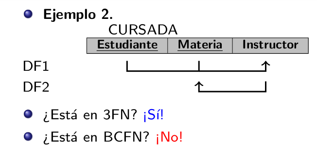

Y cómo solucionamos los problemas de redundancia? Descomponemos la relación en
otras más chicas que no tienen las violaciones. Queremos que eso sea

- **Sin pérdida de información** (SPI) o *lossless join*. La relación original
  tiene que poder ser recuperada de la descomposición.
- **Sin pérdida de dependencias funcionales** (SPDF). Cada DF se encuentra
  representada en algún esquema de la descomp.

Se pueden inferir dependencias funcionales a partir de otras con reglas de
inferencia, los axiomas de armstrong. De esa forma se puede **clausurar** un
conjunto de DFs infiriendo a partir de él. Esto se usa para normalizar.

## XML

TODO, no creo que importe

## Mapeo objeto relacional

TODO, no lo vimos con cecilia 2c2022

## Optimización

Cuando ejecuto una query SQL, el motor hace varios pasos,

- Parsing sintáctico de la query
- Validación semántica (si existen las tablas, etc.)
- Optimización: El optimizador arma el AR, árboles alternativos, y elige uno.
  - Para ello usa las propiedades de AR, y vemos cual podemos usar para
    disminuir costo.

  > Las BD permiten visualizar el plan de ejecución que se usó. Esto permite ver
    si las optimizaciones que uno puede hacer como desarrollador a las queries
    tienen impacto. Si el plan resultó igual, no cambió en nada.
- El motor de ejecución se encarga de ejecutarlo

La BD está organizada físicamente en *registros* (conjuntos de campos) y
*tablas* (conjuntos de registros). Asumimos que los registros son de longitud
fija (para simplificar las cuentas)

El **factor de bloqueo** mide cuantos registros entran en un *bloque* (que es la
unidad de transferencia entre el SO y el disco)

$$FB_R = \lfloor{B/L_R}\rfloor$$

donde,

- $FB_R$ es el factor de bloqueo de un registro R
- B es el tamaño de un bloque
- $L_R$ es la longitud del registro

Una tabla se puede organizar como

- **heap**: Cuando no hay clustered index definido
- **arbol B**: Cuando hay clustered index definido

### Índices

Los **índices** son estructuras independientes de los datos que sirven para
acelerar las búsquedas. Hay dos tipos,

- **Clustered index**: está ordenado igual que la tabla. Dicta el orden físico
  de los datos en una tabla. Es un árbol B en donde las hojas son las filas de
  datos, ordenadas según las columnas del clustered index key.

  Un clustered index no es una copia de la tabla, *es* la tabla con un árbol B
  encima, para que esté ordenada por la clustering key. Por esto se puede tener
  uno solo por tabla.

  Es como el de la parte de adelante de un libro.

- **NonClustered index**: como el de la parte de atrás de un libro, está
  desordenado.

  Están diseñados para mejorar la performance de queries críticas, frecuentes y
  caras. Tiene la misma estructura de árbol B, pero las hojas no contienen las
  filas, solamente la info de la clave del índice cluster (para poder hacer
  seek) + la clustered index key (para poder ir ahí a buscar las rows, asumiendo
  que la tabla es b tree) + columnas extra que agregamos con INCLUDE (por
  conveniencia)

  La estructura es similar a un clustered index, pero las hojas incluyen el
  valor de la clave (para poder hacer seek en el índice) y el row id (para poder
  volver a la tabla original y buscar todos los datos, suponiendo que es heap y
  no b tree)

  El row id,

  - En heap tables representa la ubicación física del a página
  - Para tablas con clustered index, representa el clustered index key de la fila.

Tiene dos operaciones principales,

- **Index Scan**: recorrer toda las hojas del indice
- **Index Seek**: aprovechar la estructura del índice para recorrer solo las
  hojas que necesita.

Si una tabla tiene muchos índices, está mal diseñada.

Suelen estar implementados con árboles B+ (son árboles balanceados como los
binarios pero los nodos pueden tener más de dos hijos). También pueden
ser hash tables.

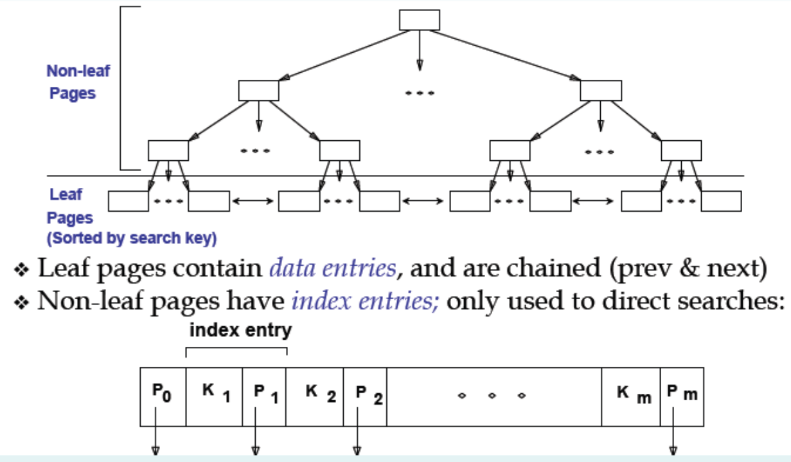

Cuales son los costos de búsqueda?

| Tipo de archivo        | A = a                                         | A > a |
| ---------------------- | --------------------------------------------- | ----- |
| Sin índice (Heap File) | $B_R$                                         | =     |
| Sorted File            | $\log_2(B_R) + \lceil \frac{T'}{FB_R} \rceil$ | =     |
| Índice B+ Clustered    | $X + \lceil \frac{T'}{FB_R} \rceil$           | =     |
| Índice B+ Unclustered  | $X + T'$                                      | =     |
| Hash Index             | $MB \times B + T'$                            | $B_R$ |

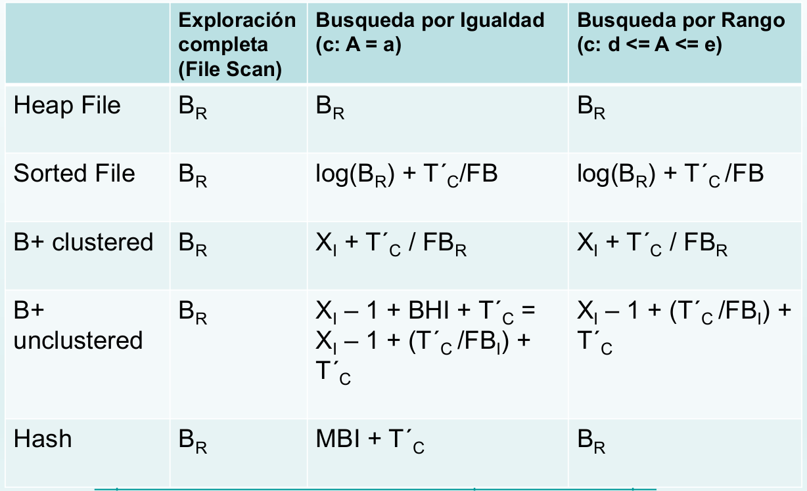
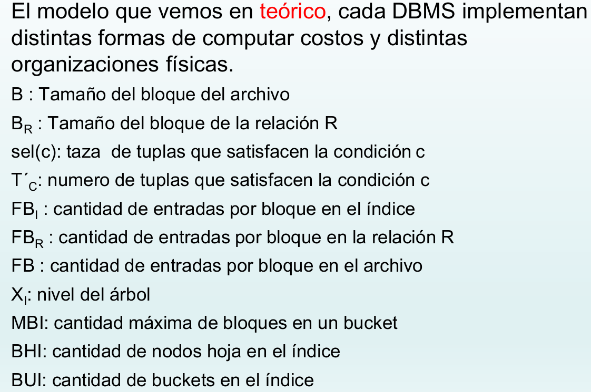

T' = cantidad de registros que cumplen con determinada condición.

para calcularlo, el motor puede usar estadísticas.

### Joins

Todos los joins se mapean a 4 operadores físicos.

- **BNLJ** (Block nested loop join) sin índices
  
  Recorre todos contra todos.

- **INLJ** (Index nested loop join)
  
  si estoy haciendo  R |x| S y sobre S tengo índice. Recorre R y para cada uno
  indexa en S.

- **SMJ** (sort merge join)

  Ordena y después hace un merge.

- **Hash merge join**

  Puede hacer una tabla de hash en el momento para resolver el join.

### Optimizador

El optimizador realiza las siguientes tareas,

- Recibe un AR
- Genera el árbol canónico (sin optimización alguna, que respeta el orden de la
  expresión)
- Arma distintos planes de ejecución alternativos
- Selecciona el mejor

Para armar distintos planes de ejecución, usa propiedades de AR como
conmutatividad. Hay también varias heurísticas,

- resolver selecciones y proyecciones lo más cerca posible de lash ojas
- Convertir los productos cartesianos en joins
- Resolver primero los selects más selectivos (que filtran más)
- Tomar en cuenta los índices existentes

Usa estadísticas sobre los datos para calcular el T' para una query como `SUELDO
>= 50.000`

Ejemplo de árbol:

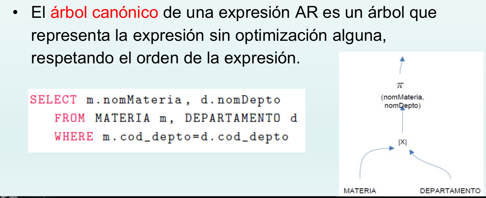

## Transacciones

Una **transacción** es un conjunto de operaciones físicas que tienen que
comportarse atómicamente, como una sola operación lógica.

Usamos una abstracción de las bases de datos en donde la cosa más chica es un
*data item* (puede ser un registro, tabla, etc.) a la cual le hacemos read y
write.

La responsabilidad de un DBMS al recibir una transacción es

- o bien que todas las operaciones de la trx sean ejecutadas exitosamente y sus
  resultados sean almacenados (**commit**)
- o en caso contrario que ninguna operación tenga efecto sobre la BD (**abort**)

Si una transacción falla antes de hacer el commit, el DBMS tiene que *deshacer*
los cambios realizados por ella.

Razones para hacer abort,

- System crash, falla en disco, problemas físicos o catastróficos
- Falla en la transacción o sistema (excepción)
- Ejecución de control de concurrencia (a veces puede abortar transacciones por
  violar la serialización o por deadlock, se reinician más tarde)

Las transacciones tienen 5 propiedades deseables para ejecutar métodos de
control de concurrencia y recovery. ACID

- **Atomicidad** (Atomicity): la transacción se comporta como una unidad
  atómica. O se ejecutan todas sus operaciones o no se ejecuta ninguna.

  > Responsabilidad del subsistema de recovery

- **Consistency preservation** (Consistencia): todos los constraints que se
  cumplan previo al commit siguen cumpliendose luego de él (pk, check
  constraints, etc.). La BD se mueve de un estado consistente a otro consistente

  > Responsabilidad de recovery

- **Isolation** (Aislamiento). La ejecución de una transacción no interfiere con
  la de otra que se ejecute de forma concurrente. Tienen que hacer parecer que
  se ejecutan de forma aislada de las otras, incluso si se están ejecutando
  concurrentemente.
  
  > Responsabilidad del subsistema de control de concurrencia

- **Durability** (Durabilidad): Si una trx hace commit, está persistida en la
  DB. No se pueden perder a causa de ningún fallo.

  > Responsabilidad del subsistema de recovery

## Control de concurrencia

Como pueden ejecutarse varias transacciones concurrentemente, es posible que
haya condiciones de carrera

=> **es necesario algún mecanismo de control de concurrencia**

Las operaciones que dan problemas son lecturas y escrituras sobre el mismo data
item en distintas transacciones.

En general, el nivel de concurrencia es bajo (y por eso son buenos los esquemas
optimistas)

### Problemas posibles

- Lost update: el clásico que vemos en SO

  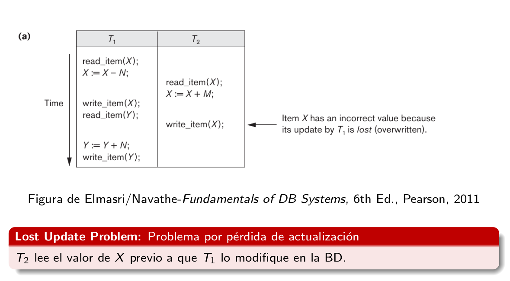

- Dirty read: read de un write que hizo abort.

  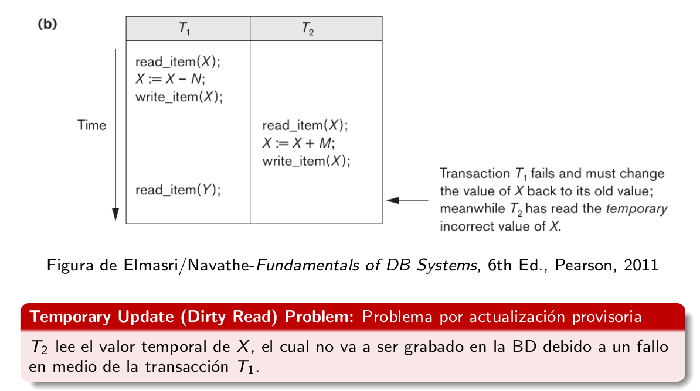

- Incorrect summary problem: leyó dos valores que si hubieran funcionado en
  forma aislada no hubieran existido. Lee una foto de la DB que nunca fue
  válida.

- Unrepeatable read problem (lee dos veces el mismo item, pero en el medio
  alguien lo modifica y recibe valores diferentes para el mismo item)

### Schedules

Formalmente, decimos que las transacciones son un órden parcial compuesto por
operaciones r_i(x), w_i(x), c_i y a_i. Es importante el orden entre reads y
writes del mismo item pero no con diferentes items. Los commits y aborts van al
final.

Una **historia** o plan o schedule es un ordenamiento de un conjunto de
transacciones. Las operaciones de cada transacción tienen que respetar su orden.

Decimos que dos operaciones **entran en conflicto** si son sobre el mismo item,
distintas transacciones y al menos una es un write.

Dos historias son **equivalentes** si resuelven las operaciones en conflicto en
el mismo orden.

Una historia es **serializable** si es equivalente a una serial. (resuelve los
conflictos de formas que no generan problemas.)

Por qué es importante esto? Si existe una manera de ejecutarlas concurrentemente
y obtener el mismo resultado que si fueran ejecutadas en orden, mejoramos la
performance sin comprometer la correctitud de las operaciones y la consistencia
de la BD.

> Para hacer un scheduler de transacciones, hay que demostrar que sus salidas
> son serializables.

**Teorema de seriabilidad:**

- Construimos el grafo de seriabilidad (arco de una transacción a otra si tienen
  operaciones que entran en conflicto)

- Si es acíclico, es serializable, y los órdenes seriales equivalentes son todos
  los ordenes topológicos del grafo.

Ejemplo de grafo:

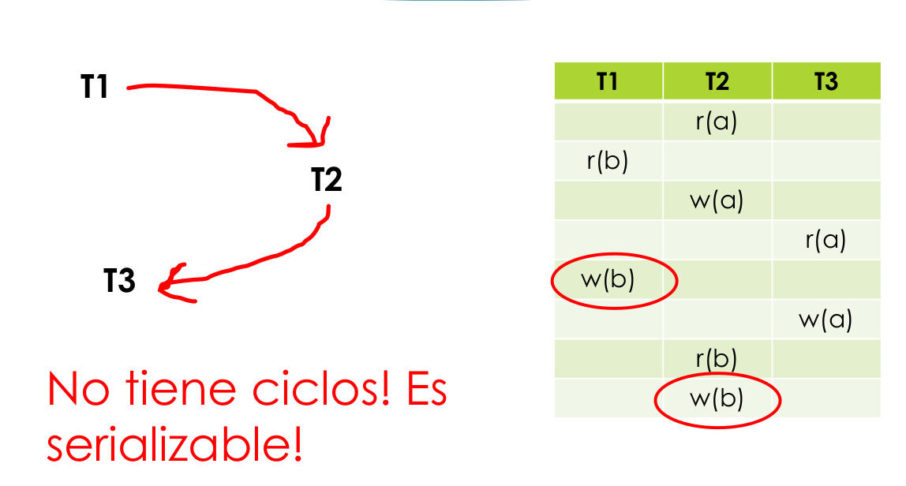

### Tipos de historias (Recuperabilidad)

Decimos que **una transacción Ti lee de otra Tj** si lee un ítem X que Tj
escribió antes de que aborte.

- Una historia es **recuperable** (RC) si las transacciones solo hacen commit
  luego de que lo hagan todas las transacciones de las que leyeron.
- Una historia **evita aborts en cascada** (ACA) si todas las transacciones leen
  valores solo de transacciones commiteadas.

  Un abort en cascada sería si T1 lee de T2, y T2 hace abort, T1 también tiene
  que abortar (porque leyó un valor que "nunca existió" por atomicidad)

- Una historia es **estricta** (ST) si las transacciones no pueden **escribir**
  ni leer antes de que la transacción que lo escribió previamente haga commit u abort.

Relación entre ellas: ST $\subseteq$ ACA $\subseteq$ RC

y son conceptos ortogonales a seriabilidad.

### Mecanismos de control de concurrencia

Cuando llega una operación de una transacción, el scheduler puede rechazarla,
procesarla o demorarla.

- **Pesimistas**
  - **Lock binario** (mutex de siempre)
  - **Shared lock** (RW lock, compartido para reads y exclusivo para writes)
  - Hace falta un protocolo para que los locks sean seriales. **Two phase
    locking**. Hay una fase en donde se toman todos los locks y otra en donde se
    liberan.

    Asegura seriabilidad de conflictos pero no es libre de deadlocks ni aborts
    en cascada.

    Variaciones: estricto y riguroso (asegura RC y ACA pero puede haber
    deadlocks), conservador (no puede haber deadlocks pero no asegura ST)
  - Introducen el wait-for graph. Hay deadlock cuando tiene ciclos
- **Optimistas**: Se basan en que la concurrencia suele ser baja, y los aborts
  no suceden casi nunca. No hay locks
  - **Timestamp**
    - Cuando arranca cada transacción, se le asigna un timestamp que determina
      orden serial que deberían tener
    - Cuando quiero hacer una operación, veo si hay alguna más nueva que ya la
      hizo, llevando a un comportamiento *físicamente irrealizable* (y hago
      abort)
      - **Read too late**. Cuando llega un read comparo con el max write. Si
        escribió una transacción posterior, debería haber leido el valor
        anterior -> read too late.
      - **Write too late**: cuando llega un write tengo que comparar con el max
        write y max read
        - si hay un read de una transacción posterior, tenía que leer lo que
          esta iba a escribir pero tardó mucho en escribir -> write too late
        - Thomas write rule: si hubo un write por una transacción posterior, se
          puede descartar el actual (siempre y cuando no haya un read en el
          medio).

  - **Timestamp multiversión**
    - Guardan una versión de cada item por escritura.
    - Cuando vas a leer, te devuelve la versión escrita por la transacción con
      máximo timestamp menor al propio.
    - Evitan read too late (porque leés la versión anterior y ya)
    - No evitan write too late y no hay thomas write rule (siempre se crean las
      versiones)

### Niveles de aislamiento

El **nivel de aislamiento** define el grado con el que una trx debe ser aislada
de las modificaciones a los datos hechas por otras transacciones.

Está determinada por los siguientes fenómenos

- **Dirty read**: lectura de transacciones no commiteadas
- **Non repeatable read**: leer el mismo dato dos veces y obtener valores
  distintos, porque una transacción se metió en el medio y modificó el dato
  antes de la segunda lectura.
- **Phantom read**: la transacción re ejecuta la misma query pero el resultado
  es distinto. Es un caso especial de non repeatable reads, en donde la otra
  transacción no modifica los valores sino que inserta o borra tuplas.
- **Lost update**: dos transacciones quieren escribir el mismo item
  concurrentemente y una sobreescribe el update de la otra.

Niveles de aislamiento:

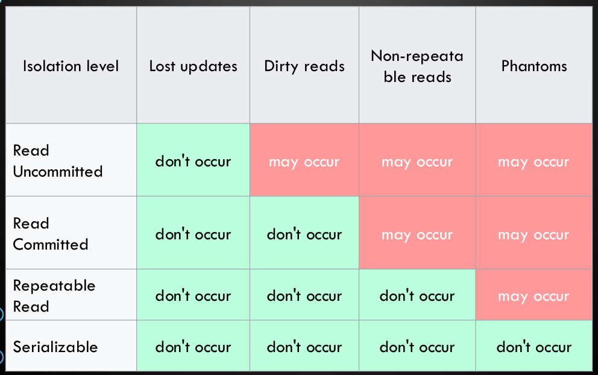

## Recuperación (Logging)

El **recovery manager** debe llevar registro del inicio y fin de las
transacciones, sus reads o writes y sus commits u aborts. Para ello hace uso del
**log** (o DBMS journal). Este le permite reestablecer el sistema ante fallos
que afectan las transacciones

Una transacción está en condiciones de hacer commit si todas sus operaciones
fueron ejecutadas exitosamente Y los efectos de todas fueron guardados en el
log.

El recovery tiene que asegurar atomicidad, consistencia y durabilidad

Tipos de recovery manager

- Undo
- Redo
- Undo-Redo
- No undo - No redo

Puede haber *checkpoints*

> La DB no graba a disco en el momento en el que se hace commit, sino que hay un
> buffer de memoria. Cuando baja a memoria, hace checkpoint. Esto asegura la
> durabilidad, porque las operaciones del log son idempotentes y se bajan a
> disco antes de las operaciones.

Sirven para no tener que mantener el log para siempre. Fuerza el almacenamiento
físico de un estado consistente de la base de datos (flushea los datos dirty).
También acorta el proceso de recovery: todas las entries que fueron hechas
previas al checkpoint se pueden ignorar.

- No quiescente: permite que entren nuevas transacciones durante el ckpt
- Quiescente: **No** permite que entren nuevas transacciones durante el ckpt

El log tiene otros usos además de recovery,

- Backups (de la BD entera)
- Analitica

## NoSQL

Son bases de datos no relacionales, que fueron diseñadas para acomodar datos no
estructurados (o semi). Suelen ser fáciles de escalar horizontalmente (agregar
más máquinas)

Cuando estoy llegando al límite de capacidad, tengo dos alternativas (no
excluyentes, pueden estar combinadas)

- **Replicación**: Copiar más datos entre servidores. Usa una arquitectura
  master-slave, en donde solo master hace lectura y el resto hacen escritura.
- **Fragmentación**: Fragmentar en distintos servidores
  
  Divido mis datos en diferentes servidores. Tiene que haber algo que me diga
  qué va en donde. Dos tipos:

  - Vertical: Mando distintas columnas a servidores distintos. Hay que duplicar
    la PK para poder hacer las juntas.
  
  - Horizontal: Se suele llamar **sharding**. Parto las filas según el valor de
    algún campo. Se trata de que los fragmentos estén balanceados.

Características de bases NoSQL

- No tienen esquema
  - No se pueden hacer consultas complejas con un lenguaje unificado y provisto
    la DB (como es el caso de SQL)
- Mecanismos sencillos de replicación
- Interfaces sencillas, limitados 
- Pueden almacenar grandes volúmenes de datos
- Cumplen con BASE y no ACID.

### BASE

- **Basic Availability**: Garantiza disponibilidad según el teorema CAP
  
  Las bases de datos NoSQL toman un acercamiento diferente a las relacionales.
  En vez de tener una única copia de la DB y centrarse en tolerancia a fallas
  (logging), distribuyen los datos en muchas copias con un alto grado de
  replicación. Si sucede una falla, no necesariamente afecta a toda la DB.

- **Soft State**: el estado de la DB puede cambiar a lo largo del tiempo, aún
  sin intervención externa. Se debe a la consistencia eventual.

  En ACID la consistencia implica una única "versión" de cada dato. En cambio,
  en BASE la consistencia es responsabilidad de los devs, y no es administrada
  por la DB.

- **Eventual Consistency**: El sistema va a ser consistente a lo largo de
  tiempo, siempre que durante él no reciba inputs nuevos.
  
  Cuando hago una modificación, puedo decir a cuantos
  modifico. El resto en algún momento recibe la actualización (via gossip)

  > NoSQL aplica bien cuando no necesitás si o si ver la última versión de un
  > dato

  Los datos deben converger a un único estado consistente en algún momento del
  futuro. No hay garantías de en que momento va a ocurrir eso.

### Teorema CAP

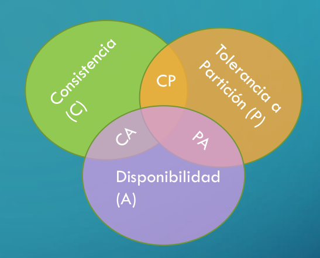

Si tengo una DB distribuida y hay alguna falla, a lo sumo puedo garantizar 2/3
de CAP. Cualquier sistema que comparta datos a través de una red puede tener a
lo sumo dos de tres propiedades.

- **Consistency** (Consistencia) equivalente a tener una única copia de los
  datos

  Todos los nodos del sistema ven exactamente los mismos valores de los datos en
  el mismo momento del tiempo. Si hacemos un read sobre un sistema consistente,
  tiene que retornar el valor del write más reciente. Y todos los nodos tienen
  que leer el mismo valor.

- **Availability** (Alta disponibilidad) de los datos para modificaciones
  
  En un sistema distribuido asegura que está operacional todo el tiempo. Cada
  solicitud retorna una respuesta (y no un error) independientemente del estado
  individual de un nodo.

- **Partition tolerance** (Tolerancia a las particiones) (de red)

  Asegura que el sistema no falla, independientemente de si los mensajes se
  pierden o se retrasan o se cae algún nodo del sistema.

  *es una necesidad en sistemas distribuidos*. Se hace posible replicando datos
  en distintos nodos y redes.

Diferentes implementaciones

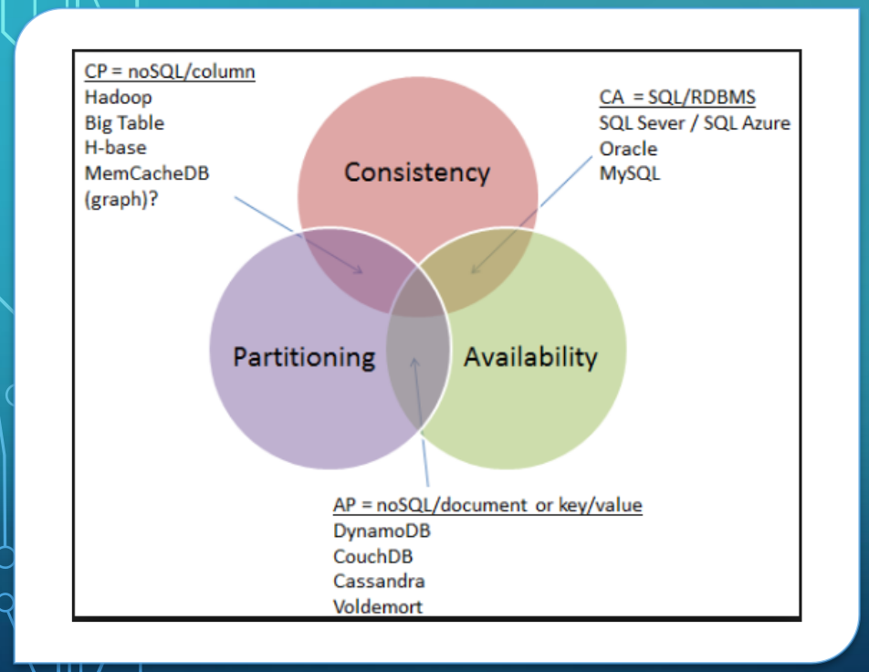

> Como las bases NoSQL tienen consistencia eventual, aseguran PA

### Teorema PACELC

Agrega el tiempo que un usuario está dispuesto a esperar

### Tipos de consistencia

- Read your writes
- Session consistency
- Monotonic reads consistency
- Monotonic writes consistency
- Consistency prefix

### Tipos de bases NoSQL

Tipos de bases NoSQL

- **Key value store** (redis): la menor unidad de modelado es un par clave valor. Se
  pueden guardar objetos diferentes en la misma base bajo distintas claves.
- **Document store** (dynamo, mongodb): la menor unidad de modelado es un
  documento
  - Son parecidas a las key value, pero el documento está semi estructurado, no
    se puede guardar cualquier cosa. Pueden tener formato XML, JSON, etc.
  - Ejemplo: MongoDB. Hace sharding por un campo que se puede especificar.
    Permite hacer MapReduce y queries adhoc (igualdad de campos, rangos, regex)
- **Column family** (cassandra): guardan una familia de columnas.
- **GraphDB** (Neo4J): modelan toda la estructura como un grafo
  - Para ver problemas de distancias (para clusterizar gente x ej) es más fácil
    con grafos en lugar de relacional, porque es recursivo. Por ej. el camino
    entre dos personas
- **Stream**
  - Se pueden aplicar a medicina o control industrial (sensores)

Desventajas:

- No hay chequeos automáticos de integridad referencial ni restricciones. Se
  tiene que encargar el programador.
- Para poder hacer análisis sobre los datos probablemente tenés que pasarlos aa
  una DB donde se le pueda dar estructura.

Otros tipos de bases de datos,

- **Cloud database**:  Es DB as a service (DBaaS). Hay relacionales y no
  relacionales.
  - Elástico a demanda
  - No mantengo yo la info
    - es costoso de mantener inhouse (centro de cómputo, gente)
    - pero traer problemas de seguridad y posibles implicancias legales (como
      las leyes que te fuerzan a que los datos estén en el mismo país).

- **Multi tenant**: Una app que comparten distintos usuarios (empresas). Hay tres formas,
  - Una DB entera por cliente
  - Un esquema por cliente
  - Unico esquema para todos
    - Hay que hacer where por empresa, y problemas de seguridad.

- **In memory DB**. Hay dos tipos
  - Si se corta la luz, los datos se pierden (sirve para cache, como redis)
  - Datos en memoria y un log para reconstruirlos por si falla (parecido a
    journaling file systems)

### Pros y Cons

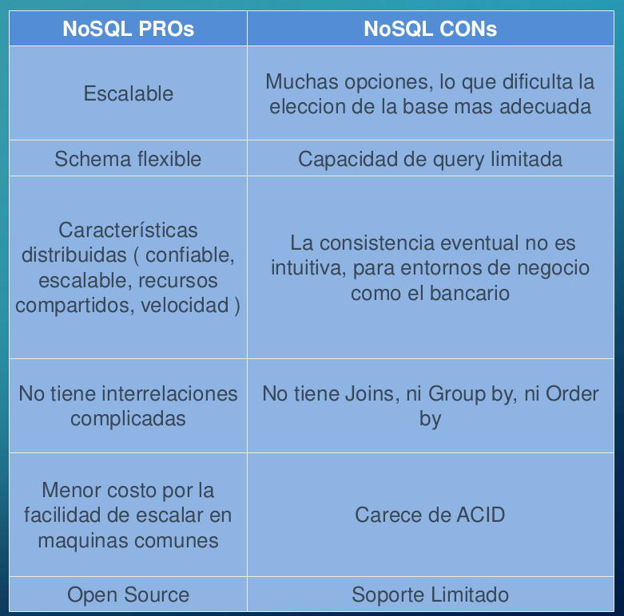

## Bases especiales

- Espaciales
- RDF (Resource description format). Es como prolog pero almacenado en una DB.

## Bases distribuidas (relacionales)

Como la replicación para no SQL con el teorema CAP pero ahora volvemos a
relacionales.

- **Paralelas**: Tengo 1 equipo, 1 DMBS, N procesadores.

  Tengo un equipo multiprocesador, como aprovecho un solo DMBS para que use
  todos los cores? Dos opciones. Inter operación e intra operación

  - Inter operación: Asignar diferentes operaciones a diferentes procesadores.
  - Intra operación: paralelizar una operación entre distintos procesadores
    (tomar los distintos operadores del AR y mandarlos a distintos proc)

- **Distribuidas**: Tengo N equipos con N DMBS, puede tener 1 o más procesadores
  Pueden ser homogeneas (mismo DMBS) o heterogeneas (diferente DMBS, mismo
  modelo o diferente modelo de datos)
  Dos versiones diferentes.
  - 1 modifica y las demás reciben (publish subscribe)
  - Todos modifican

  Opinión de ceci: Las BDs distribuidas están muertas

  Para hacer transacciones distribuidas hay protocolos, como 2PC (Two Phase
  Commit)

## OLTP vs OLAP

Problemas diferentes que tienen que resolver las bases de datos:

- **OLTP**: Online transaction processing. Todo lo que vimos hasta ahora,
  operativo, transacciones cortas.
- **OLAP**: Online analytica processing. Hacer análisis sobre los datos,
sumarizarlos, etc.

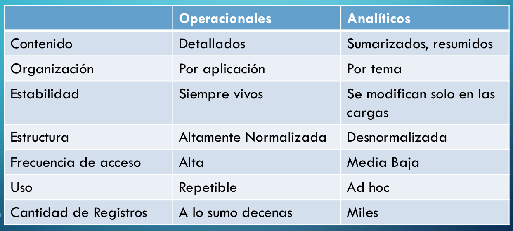

## Temas extra

### Big Data

5 Vs que describen sus características

- **Volumen** grande
- **Variedad**: hay muchos formatos diferentes (importante en el contexto de una
  DB)
- **Velocidad**: el volumen incrementa rápido
- **Valor**: cómo le saco valor a los datos?
- **Veracidad**: calidad de los datos.

Qué es que organización sea *data driven*? Que toman decisiones basándose en los
datos. Forman parte del proceso de decisión, juegan un rol. Pero las personas no
usan solo eso, y hay que modificarlos para poder hacer uso de ellos.

Principales dimensiones:

- Aspectos técnicos
  - Data warehouse: Tengo varios sistemas distintos y quiero hacerlos confluir a
    una viunificada de los datos. Fracasa porque se vuelve bottleneck del sistema.
  - Data lake: Juntamos los datos y los tiramos a algún lugar. Pero termino no
    pudiendo leerlos, que hace que mucha gente le llame "data swamp" (pantano)
  - Data lakehouse: Lo mejor de ámbos mundos
- Responsabilidad: quién se encarga de los datos?

  Históricamente, la tarea era hecha por un único equipo de datos centralizado.
  Trae problemas de escalabilidad.

  Hoy: enfoque **Data mesh**. Los mismos dueños de los datos son los que los
  disponibilizan para los demás. Principios

  - Domain driven data ownership & architecturte: cada negocio prepara y dispone
    sus datos para que los consuma el resto de la org.
  
    Es clave no proveer los datos directamente, sino esconder un poco la
    complejidad (los datos tienen mucha)

  - Data as a product. Características clave
    - Descubrible
      - Ideal: Data discovery: Herramientas para que las personas descubran de
      forma propia los datos.
    - Buscable
    - Confiable
    - Autodescriptivo
    - Interoperable
    - Seguro
  - Self serve infrastracture as a platform. Proveer una infra común para que no
    reinvente la rueda cada equipo.
  - Federated computational governance. Sino, cada uno con su propio sistema.

  Cambio de filosofía: los datos también son un problema de los equipos de
  desarrollo.

- Uso: los usuarios de los datos pueden ser internos o externos.
  
Metadata: un regalo a mi mismo dentro de 10 años. Clave para entender los datos.

Antes se hacía ETL (Extract, transform, load) pero ahora se hace ELT (extract,
load, transform). Nadie se salva de amasar los datos, porque los sistemas
no los guardan listos para consumir.

### Open Data

Datos públicos en un formato legible por una computadora. Se publican con dos
finalidades transparencia y generación de servicios para empresas

Publican: Estados, organizmos internacionales, empresas

Consumidores: Periodismo (data driven journalism), ONGs, emprendedores, académicos

### Data Mining

"Torturar a los datos hasta que hablen".

Previo al data mining hay que integrarlos y laburarlos. Es muy importatne
entender los datos para saber qué tener en cuenta => equipos
interdisciplinarios.

Hay dos grupos

- Supervisado: Aprende de ejemplos
  - Redes neuronales
  - Árboles de decisión
  - Regresiones
- No supervisado. Te doy los datos y me contás lo que ves
  - Clustering
  - Reglas de asociación

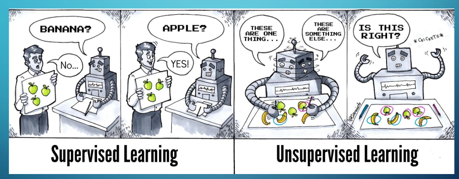

Tener en cuenta los **outliers**: valores que se van de lo normal.

> Ejemplo: Luis miguel le compra un anillo a la novia por muchísima plata. Te
> rompe todas las estadísticas. Para evitar que genere problemas puedo usar
> cuartiles.

Tienen dos fuentes:

- Cosas *realmente* fuera de lo normal
- Errores

Pero no hay que descartarlos porque en las anomalías se pueden encontrar
problemas, por ej. en AFIP para fraude ("o es YPF, o es fraude").

### Gobierno de datos

Determina quien tiene acceso a los datos y qué puede hacer con ellos
